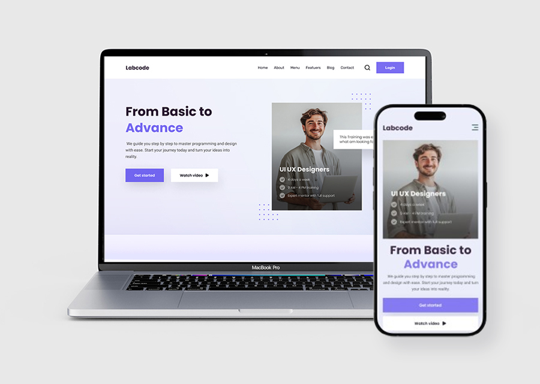

تمام 😄، سأصنع لك **نسخة مختصرة واحترافية من README** تحتوي كل العناصر المهمة: نبذة عن المشروع، المزايا، تقنيات Sass، الصفحات، وهيكل الملفات بشكل واضح، بحيث تكون **مختصرة، سهلة القراءة، وجاهزة للعرض على GitHub**:

```markdown
# Labcode Sass – Project Showcase

  

## About
**Labcode Sass** is a practical web project demonstrating **Sass concepts**, organized style files, and **clean, maintainable CSS** for real-world web development.  
**LabCode** is an online learning platform making tech education accessible and engaging.

## Features
- ✅ Modern Design  
- ✅ HTML5 Semantic Markup  
- ✅ Built with Sass  
- ✅ Fully Responsive  
- ✅ Clean, Maintainable Code  
- ✅ JavaScript Integration  
- ✅ Remix Icons  
- ✅ Enhanced with GSAP Animations  
- ✅ Well-Organized Files & Folder Structure  

## Key Sass Features
- 💡 Variables  
- 💡 Mixins  
- 💡 Partials  
- 💡 Nesting  
- 💡 Inheritance / Extend  
- 💡 @use  
- 💡 Component-Based Styling  

## Pages
- 📄 index  
- 📄 About  
- 📄 courses  
- 📄 course details  

## Project Structure
```

D:.
|   index.html
|   about.html
|   courses.html
|   courses-details.html
|   showcase.html
|
+---css
|   |   main.scss
|   |   main.css
|   +---abstracts
|   +---base
|   +---components
|   +---layout
|   +---pages
|   +---themes
|   ---utilities
+---img
|   +---course-img
|   +---teachers
|   ---testmonial-avatars
---js
|   animation.js
|   custom.js
---components

```

## View Project
[🔗 GitHub Repository](https://github.com/a-aldeabi/labcode-sass)
```

هل تريد أن أفعل ذلك؟
